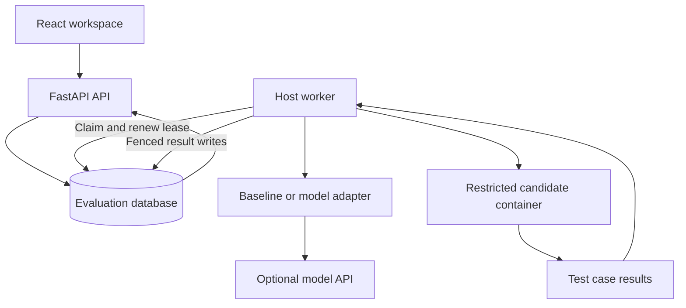
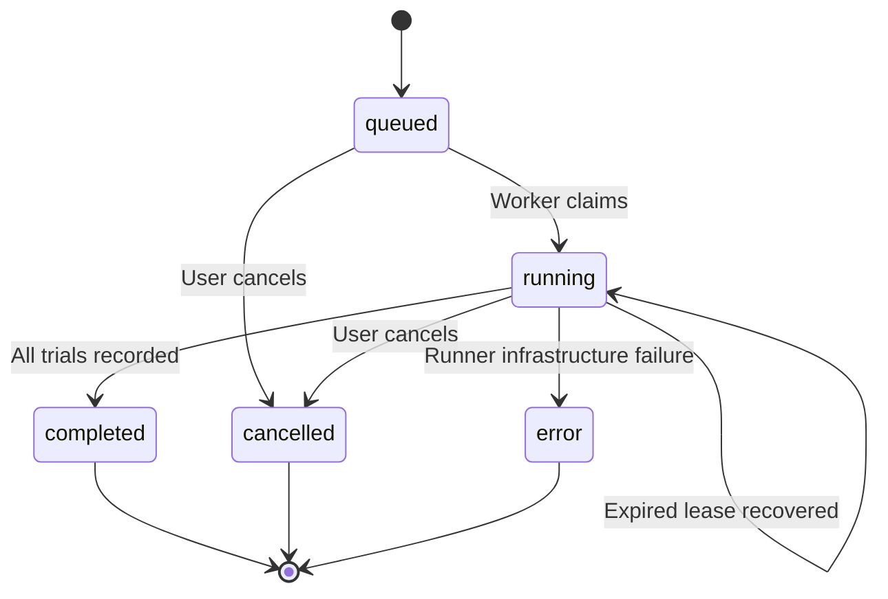

# Architecture

AgentBench separates accepted evaluations, code generation, candidate execution, and evidence. API requests never execute generated code.

## Acceptance

A submission validates selected unique task IDs, repeat count and agent availability. It locks the owner's account row under PostgreSQL or reserves SQLite's writer lock. It applies an active-run cap, persists an immutable suite snapshot, SHA-256 fingerprint, request fingerprint and idempotency key, and returns a durable queued run. Repeated identical requests return the existing run; conflicting reuse returns HTTP 409.

The queue is a database table, so accepting work does not depend on a broker. There is no Redis or Celery requirement in this product. The worker polls the queue; it atomically updates an eligible run using the same eligibility predicate and a new lease token. Another worker cannot process the claimed run until the lease expires.

## Trial lifecycle

For every selected task and repetition, the worker renews the lease, skips an already-recorded trial, generates a source file, executes it, then writes a unique task/repeat result while holding the same lease token. A worker that loses ownership or receives cancellation cannot write its in-flight result. Cancellation clears ownership immediately; an in-flight provider request or container can finish its bounded operation, but its result is discarded.

Lease duration is 180 seconds; the provider timeout is 45 seconds and candidate deadline is 10 seconds. Lease renewal occurs between trials. Heartbeats record worker runner mode/readiness and refresh between trials or while polling. The API considers a heartbeat stale after 90 seconds.

If the worker dies, another worker may resume after expiry. Persisted trials are not repeated. An unpersisted generation can be repeated and charged again: this is at-least-once trial execution, not exactly-once external billing. A unique constraint prevents duplicate recorded trials.

## Storage

| Table | Purpose |
| --- | --- |
| users | Account identity and scrypt password hash |
| sessions | Hashed session secret and expiry |
| throttles | Atomic per-account/IP login counter |
| runs | Ownership, snapshot, fingerprints, queue state and lease |
| trials | Source, case evidence, timings, model usage and error |
| worker_status | Recent host worker readiness heartbeat |

Amounts are decimal USD strings; missing cost remains null. SQLite uses WAL and explicit transactions, with `BEGIN IMMEDIATE` for mutations that read before writing. This prevents concurrent workers from failing while upgrading stale read snapshots. PostgreSQL uses ordinary transactions, conditional writes and owner-row locking.

## Deployment boundary

The API can run in a container with PostgreSQL. The worker runs on a dedicated Docker host, uses the same database, and launches one candidate container at a time per worker process. The API does not receive the Docker socket. SQLite is suitable for a local demonstration; PostgreSQL is the deployment path for separate API/worker processes or hosts.

Versioned migrations preserve the initial schema. `initialize()` provides idempotent first-use bootstrap for local tests/seed; it does not replace migration upgrades. Run `alembic upgrade head` as part of deployment.
